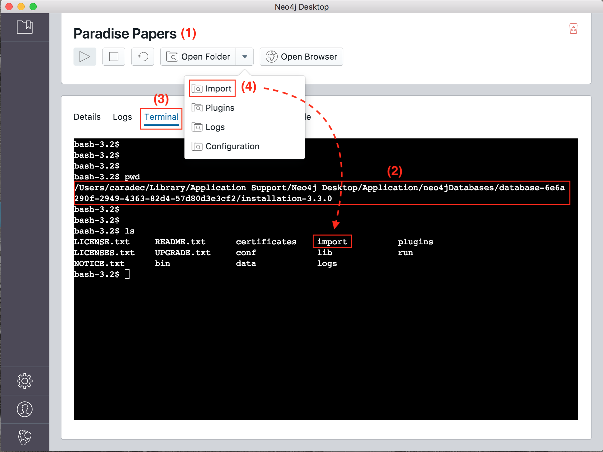
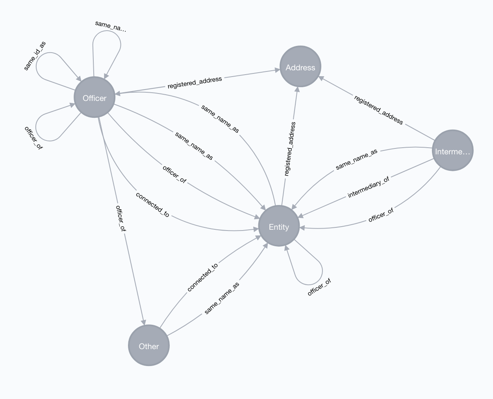
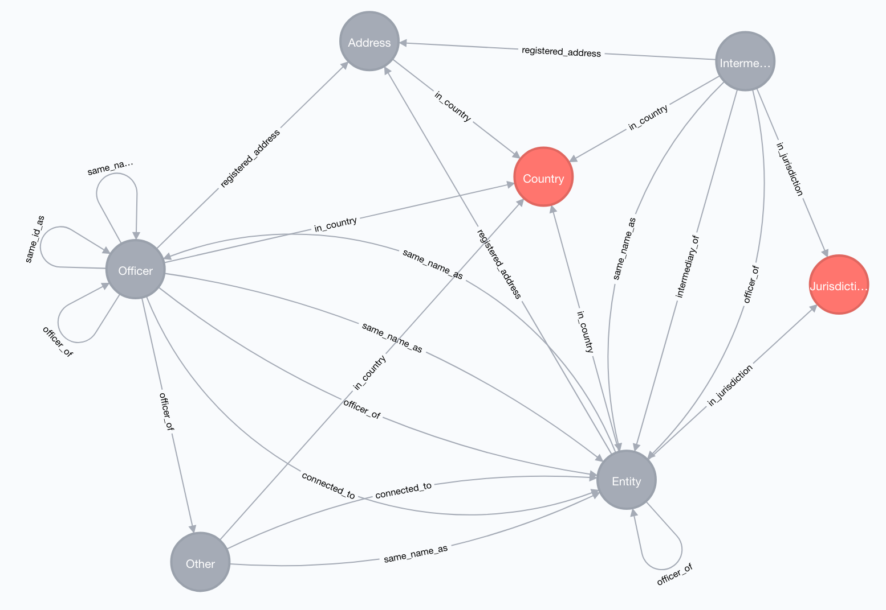

# Paradise Papers Neo4j Import

On December 1, [Neo4j](https://neo4j.com/) [released](https://neo4j.com/blog/icij-releases-neo4j-desktop-download-paradise-papers/) a version of its **Neo4j Desktop** tool containing [ICIJ Paradise Papers](https://www.icij.org/investigations/paradise-papers/) database.

This dataset, among others such as [Panama Papers](https://github.com/michelcaradec/Panama-Papers)' one, can also be downloaded from [ICIJ web site](https://offshoreleaks.icij.org/pages/database).

The following is a script to import Paradise Papers dataset into your existing Neo4j Desktop instance using [neo4j-admin](https://neo4j.com/docs/operations-manual/current/tools/neo4j-admin/) command line utility.

As it is **bash**, it only works on **Linux** and **MacOS**.

## Before Starting

All operations must be performed from Neo4j Desktop database (1) root directory (2), accessible via **Terminal** tab (3) in Neo4j Desktop. On MacOS, directory full path should be something like `/Users/$USER/Library/Application Support/Neo4j Desktop/Application/neo4jDatabases/database-$GUID/installation-$VERSION`.

Files to import will be located in **import** sub-directory (4).



## Data Retrieval

```bash
# Download
wget https://offshoreleaks-data.icij.org/offshoreleaks/csv/csv_paradise_papers.2017-11-17.zip
# Extract to import directory.
tar -xzvf csv_paradise_papers.2017-11-17.zip -C import
```

## Data Preparation

Few transformations must be done on original files to comply with Neo4j [CSV file header format](https://neo4j.com/docs/operations-manual/current/tools/import/file-header-format/).

### Nodes Files

#### Header Engineering

1. `labels(n)` => `:LABEL`.
2. `n.node_id` => `node_id:ID`.
3. Remove double-quotes.
4. Remove "n." prefixes.

Sample script:

```bash
head -n 1 import/paradise_papers.nodes.address.csv |
    sed "s/labels(n)/\:LABEL/" |
    sed "s/n\.node_id/node_id\:ID/" |
    sed "s/\"//g" |
    sed "s/n\.//g"
```

Before:

```
"labels(n)","n.valid_until","n.country_codes","n.countries","n.node_id","n.sourceID","n.address","n.name","n.jurisdiction_description","n.service_provider","n.jurisdiction","n.closed_date","n.incorporation_date","n.ibcRUC","n.type","n.status","n.company_type","n.note"
```

After:

```
:LABEL,valid_until,country_codes,countries,node_id:ID,sourceID,address,name,jurisdiction_description,service_provider,jurisdiction,closed_date,incorporation_date,ibcRUC,type,status,company_type,note
```

#### Rows Engineering

1. Remove `[""` pattern on label column.
2. Remove `""]` pattern on label column.

Sample script:

```bash
tail -n +2 import/paradise_papers.nodes.address.csv |
    sed "s/\[\"\"//" |
    sed "s/\"\"\]//"
```

Before (first two lines):

```
"[""Address""]","Appleby data is current through 2014","VGB","British Virgin Islands","81000002","Paradise Papers - Appleby","Palm Grove House","Palm Grove House; VG1110 Road Town; Tortola; British Virgin Islands","","","","","","","","","",""
"[""Address""]","Appleby data is current through 2014","MUS","Mauritius","81000005","Paradise Papers - Appleby","8th Floor, Medine Mews","8th Floor, Medine Mews; La Chaussee Street; Port Louis; Mauritius","","","","","","","","","",""
```

After:

```
"Address","Appleby data is current through 2014","VGB","British Virgin Islands","81000002","Paradise Papers - Appleby","Palm Grove House","Palm Grove House; VG1110 Road Town; Tortola; British Virgin Islands","","","","","","","","","",""
"Address","Appleby data is current through 2014","MUS","Mauritius","81000005","Paradise Papers - Appleby","8th Floor, Medine Mews","8th Floor, Medine Mews; La Chaussee Street; Port Louis; Mauritius","","","","","","","","","",""
```

### Relationships File

#### Header Engineering

1. `node_1` => `:START_ID`.
2. `node_2` => `:END_ID`.
3. `rel_type` => `:TYPE`.
4. Remove double-quotes.
5. Remove "r." prefixes.

Sample script:

```bash
head -n 1 import/paradise_papers.edges.csv |
    sed "s/node_1/\:START_ID/" |
    sed "s/node_2/\:END_ID/" |
    sed "s/rel_type/\:TYPE/" |
    sed "s/\"//g" |
    sed "s/r\.//g"
```

Before:

```
"node_1","rel_type","node_2","r.sourceID","r.valid_until","r.start_date","r.end_date"
```

After:

```
:START_ID,:TYPE,:END_ID,sourceID,valid_until,start_date,end_date
```

### Data Preparation Full Script

Reminder: script must be executed from Neo4j Desktop database root directory, in **Terminal** tab.

```bash
# Nodes
for NODES_FILE in import/*.nodes.*.csv
do
    # Header
    head -n 1 $NODES_FILE |
        sed "s/labels(n)/\:LABEL/" |
        sed "s/n\.node_id/node_id\:ID/" |
        sed "s/\"//g" |
        sed "s/n\.//g" > $NODES_FILE.refined
    # Rows
    tail -n +2 $NODES_FILE |
        sed "s/\[\"\"//" |
        sed "s/\"\"\]//" >> $NODES_FILE.refined
done

# Relationships
for EDGES_FILE in import/*.edges.csv
do
    # Header
    head -n 1 $EDGES_FILE |
        sed "s/node_1/\:START_ID/" |
        sed "s/node_2/\:END_ID/" |
        sed "s/rel_type/\:TYPE/" |
        sed "s/\"//g" |
        sed "s/r\.//g" > $EDGES_FILE.refined
    # Rows
    tail -n +2 $EDGES_FILE >> $EDGES_FILE.refined
done
```

## Import

```bash
# Clean graph.db directory.
rm -d -r data/databases/graph.db
mkdir data/databases/graph.db
# Import
bin/neo4j-admin import \
    --nodes import/paradise_papers.nodes.address.csv.refined \
    --nodes import/paradise_papers.nodes.entity.csv.refined \
    --nodes import/paradise_papers.nodes.intermediary.csv.refined \
    --nodes import/paradise_papers.nodes.officer.csv.refined \
    --nodes import/paradise_papers.nodes.other.csv.refined \
    --relationships import/paradise_papers.edges.csv.refined \
    --quote "\""

# Clean import directory
rm import/*
```

The script for the entire process can be found in [import.sh](import.sh) file.

## Metagraph

Once imported, the database **meta-graph** can be displayed in **Neo4j Browser** by running the following command, with the help of [Awesome Procedures On Cypher](https://github.com/neo4j-contrib/neo4j-apoc-procedures) (APOC) library:

```cypher
CALL apoc.meta.graph()
```



## Miscellaneous

Before importing data using **neo4j-admin**, an attempt was made to use [Cypher](https://neo4j.com/developer/cypher-query-language/) [LOAD CSV](http://neo4j.com/docs/developer-manual/current/cypher/clauses/load-csv/) command.

It worked fine for nodes import, but failed to import relationships, as their number was to important to be processed in an acceptable time (file `paradise_papers.edges.csv` contains **364 457** lines).

The script written for this attempt is available in [create.cypher](create.cypher) file.

## Extending Paradise Papers Graph

The information imported from Paradise Papers dataset, and now contained in nodes' properties, can be used to extend the database model by creating new nodes and relationships.

### Country Nodes

```cypher
MATCH (n)
WHERE n.countries <> ""
WITH
n,
split(n.countries,";") AS countries,
split(n.country_codes,";") AS codes
CALL apoc.coll.zipToRows(countries, codes) YIELD value
WITH
n,
value[0] AS country,
value[1] AS code
MERGE (c:Country {name: country, code: code})
CREATE (n)-[:in_country]->(c)
```

Output:

```
Added 178 labels, created 178 nodes, set 356 properties, created 160080 relationships, completed after 62864 ms.
```

Here again, we took benefit from [Awesome Procedures On Cypher](https://github.com/neo4j-contrib/neo4j-apoc-procedures) library by using **apoc.coll.zipToRows** function.

### Jurisdiction Nodes

```cypher
MATCH (n)
WHERE n.jurisdiction <> ""
MERGE (j:Jurisdiction {name: n.jurisdiction, description: n.jurisdiction_description})
CREATE (n)-[:in_jurisdiction]->(j)
```

Output:

```
Added 44 labels, created 44 nodes, set 88 properties, created 24958 relationships, completed after 1580 ms.
```

Resulting **meta-graph** (new nodes labels are shown in red):


